# 学食座席予約アプリ

### アプリの概要

このアプリは、学食の座席を予約することができるアプリです。学食の座席と時間を選択して予約することができます。また、予約した座席の情報を確認することができます。**このアプリは、[大学のソフトウェア開発の講義](https://risyu.jmk.ynu.ac.jp/gakumu_portal/public/Syllabus/DetailMain.aspx?lct_year=2024&lct_cd=6I3302Z&je_cd=1)内で私が設計、開発を担当したものです。**

### アプリの画面

- 新規登録 -> 新規登録実行 -> ログイン

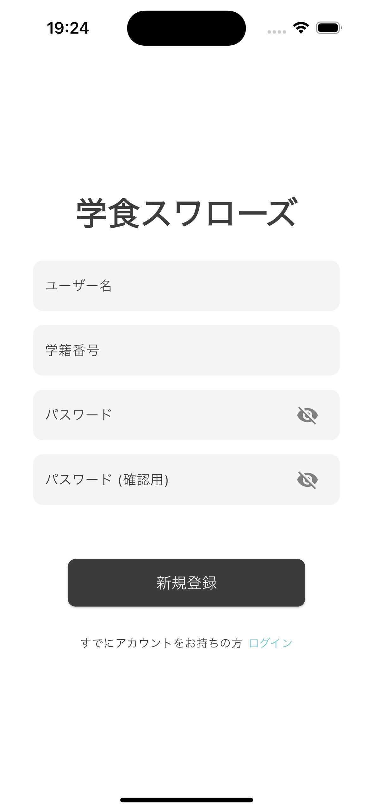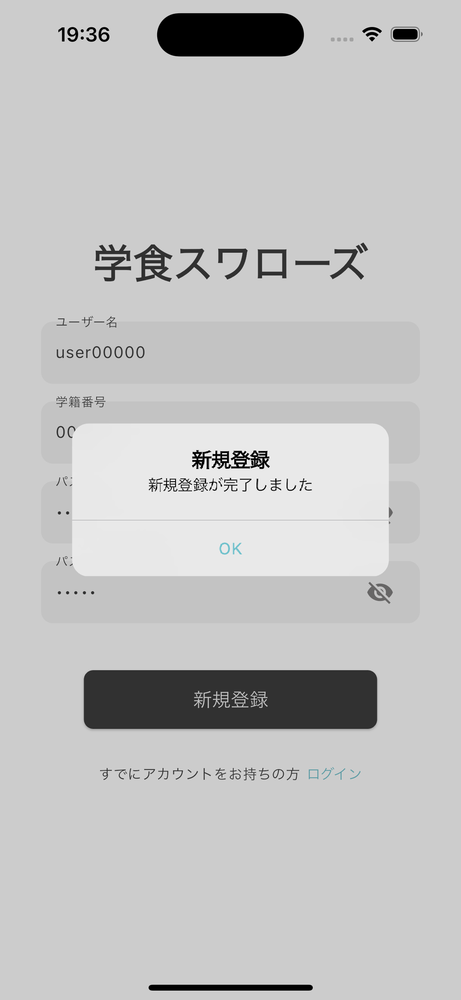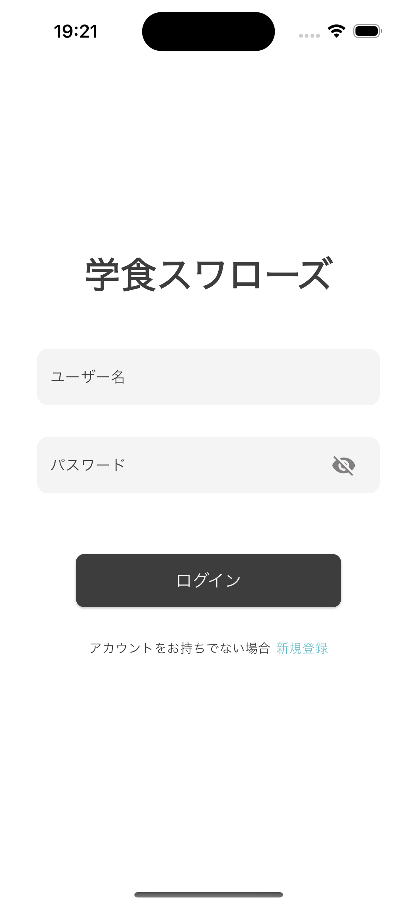

- 位置情報送信　-> 送信結果

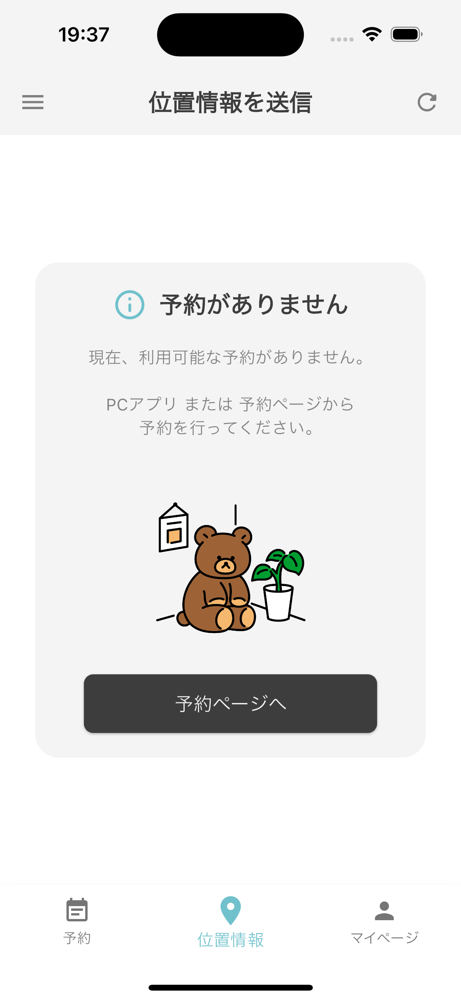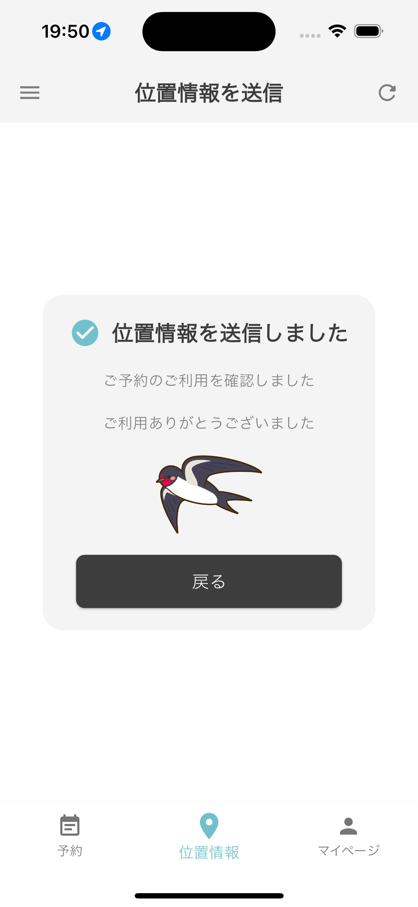

- マイページ (予約なし) -> マイページ (予約あり) -> 友達リスト

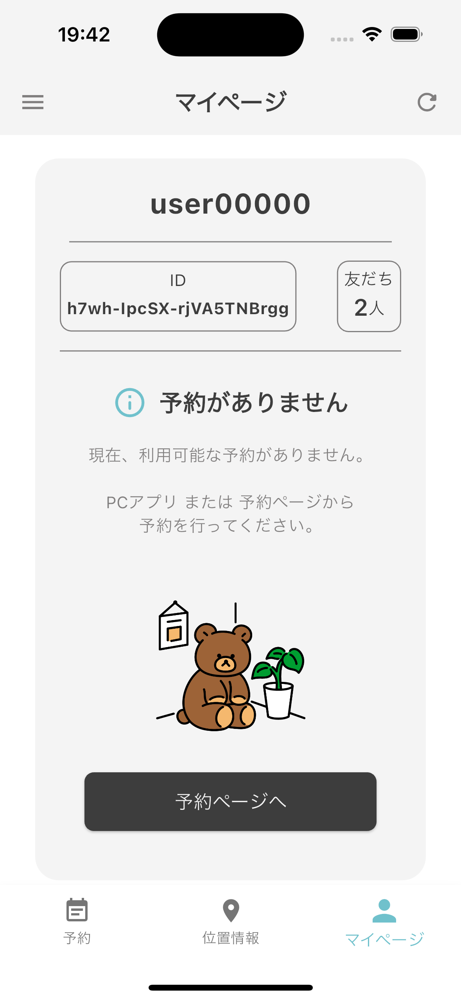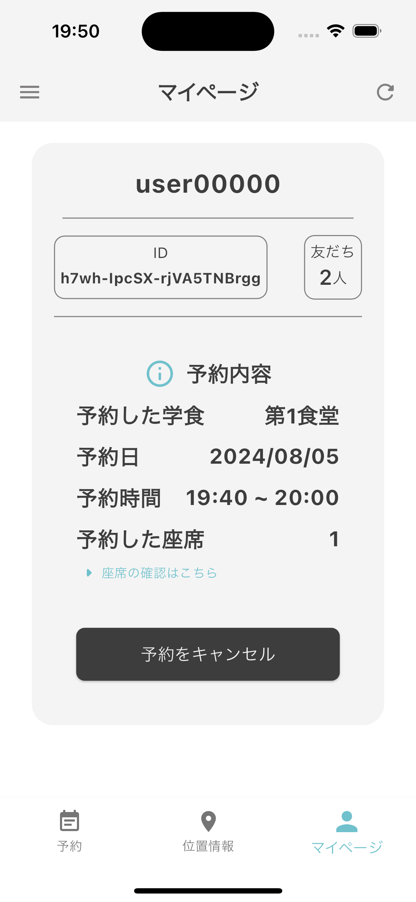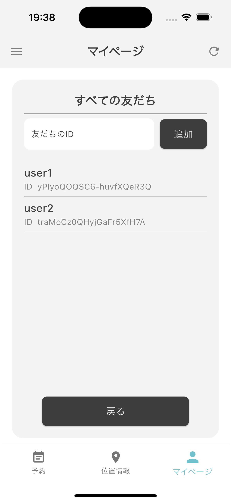

- ドロワー -> 設定 -> ダークモード

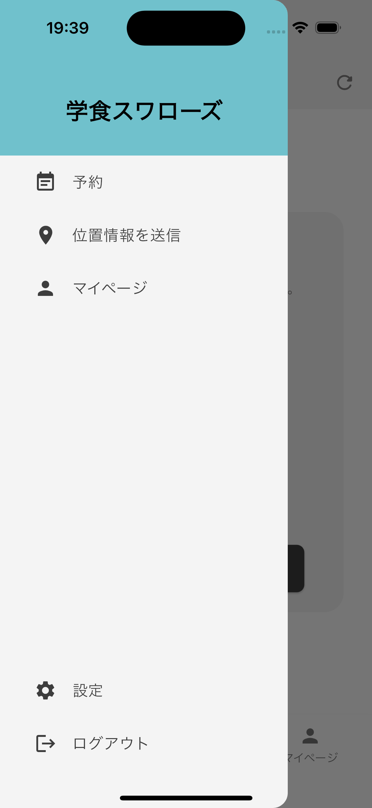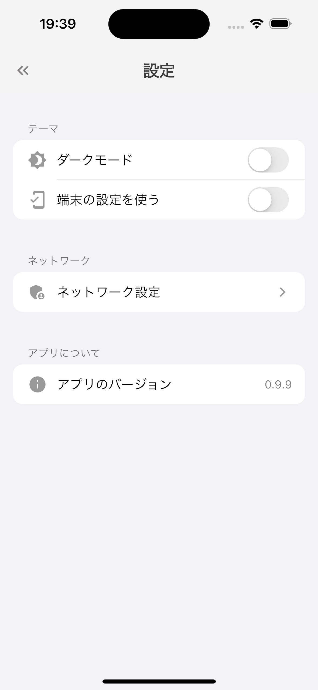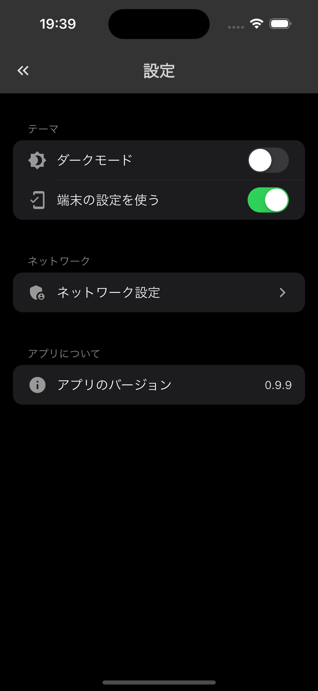

- 開発中
  座席の予約ページは開発中です。<br>※ Java の PC クライアントアプリでは実装済み。

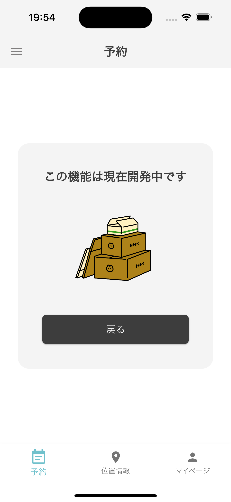

---

### ディレクトリ構成

<details>
<summary> ディレクトリ構成 (Tree)

</summary>

``` bash
lib
├── main.dart
└── src
    ├── assets
    │   └── images
    │       ├── adaptive-icon-foreground.png
    │       ├── app-icon.PNG
    │       ├── no-reservation.png
    │       ├── not-available.png
    │       ├── penalty.png
    │       ├── send-result.png
    │       └── splash-icon.png
    ├── components
    │   ├── friend_list_tile.dart
    │   ├── friend_text_field.dart
    │   ├── location_page_tile.dart
    │   ├── my_app_bar.dart
    │   ├── my_button.dart
    │   ├── my_container.dart
    │   ├── my_drawer.dart
    │   ├── my_drawer_tile.dart
    │   ├── my_textfield.dart
    │   └── not_available_page.dart
    ├── constant
    │   ├── form_category.dart
    │   ├── my_location.dart
    │   ├── my_theme.dart
    │   └── strings.dart
    ├── features
    │   ├── auth
    │   │   ├── data
    │   │   │   ├── auth_repository.dart
    │   │   │   └── auth_repository.g.dart
    │   │   ├── domains
    │   │   │   ├── auth_state.dart
    │   │   │   ├── user.dart
    │   │   │   └── user.freezed.dart
    │   │   └── pages
    │   │       ├── auth_base_page.dart
    │   │       ├── auth_state_notifier.dart
    │   │       ├── auth_state_notifier.g.dart
    │   │       ├── login_page.dart
    │   │       ├── sign_up_page.dart
    │   │       ├── user_notifier.dart
    │   │       └── user_notifier.g.dart
    │   ├── location
    │   │   ├── application
    │   │   │   ├── location_service.dart
    │   │   │   └── location_service.g.dart
    │   │   ├── data
    │   │   │   ├── location_repository.dart
    │   │   │   └── location_repository.g.dart
    │   │   ├── domains
    │   │   │   └── location_state.dart
    │   │   └── pages
    │   │       ├── location_base_page.dart
    │   │       ├── result_page
    │   │       │   └── send_result_page.dart
    │   │       ├── seat_confirm_page
    │   │       │   ├── cafeteria1_seat_page.dart
    │   │       │   └── cafeteria2_seat_page.dart
    │   │       └── send_page
    │   │           ├── location_send_page.dart
    │   │           ├── location_state_notifier.dart
    │   │           └── location_state_notifier.g.dart
    │   ├── profile
    │   │   ├── data
    │   │   │   ├── friend_list_repository.dart
    │   │   │   └── friend_list_repository.g.dart
    │   │   ├── domain
    │   │   │   ├── friend.dart
    │   │   │   └── friend.freezed.dart
    │   │   └── pages
    │   │       ├── friend_list_notifier.dart
    │   │       ├── friend_list_notifier.g.dart
    │   │       ├── friend_list_page.dart
    │   │       └── my_page.dart
    │   ├── reserve
    │   │   ├── data
    │   │   │   ├── reservation_repository.dart
    │   │   │   └── reservation_repository.g.dart
    │   │   ├── domain
    │   │   │   ├── reservation.dart
    │   │   │   ├── reservation.freezed.dart
    │   │   │   └── reservation_state.dart
    │   │   └── pages
    │   │       ├── reservation_confirm_page
    │   │       │   ├── no_reservation_page.dart
    │   │       │   ├── penalty_page.dart
    │   │       │   └── reservation_confirm_page.dart
    │   │       ├── reservation_notifier.dart
    │   │       ├── reservation_notifier.g.dart
    │   │       └── reservation_page.dart
    │   └── settings
    │       └── pages
    │           ├── setting_list
    │           │   └── server_ip_page.dart
    │           ├── settings_page.dart
    │           ├── theme_notifier.dart
    │           ├── theme_notifier.g.dart
    │           ├── use_mobile_theme.dart
    │           └── use_mobile_theme.g.dart
    ├── main_page.dart
    ├── router
    │   ├── app_router.dart
    │   ├── app_router.g.dart
    │   ├── bottom_nav_index_notifier.dart
    │   └── bottom_nav_index_notifier.g.dart
    └── utils
        ├── env.dart
        ├── my_ui_feedback_manager.dart
        ├── repository.dart
        └── string_extensions.dart
```

</details>

大まかなディレクトリ構成は以下の画像の通りです。

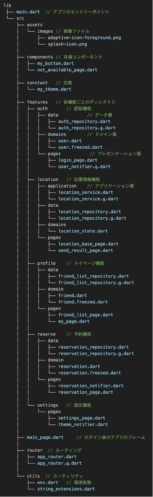

### 使用した技術

|        カテゴリ        |          技術           |
| :--------------------: | :---------------------: |
|     フロントエンド     |         Flutter         |
| サーバサイドプログラム |          Java           |
|        デザイン        |          Figma          |


#### 主に使用したFlutterパッケージ
* [flutter_hooks](https://pub.dev/packages/flutter_hooks)
* [flutter_riverpod](https://pub.dev/packages/flutter_riverpod)
* [riverpod_generator](https://pub.dev/packages/riverpod_generator)
* [build_runner](https://pub.dev/packages/build_runner)
* [freezed](https://pub.dev/packages/freezed)
* [shared_preferences](https://pub.dev/packages/shared_preferences)
* [go_router](https://pub.dev/packages/go_router)
* [location](https://pub.dev/packages/location)

---

### 最後に

プロジェクトをご覧いただき、ありがとうございます。
